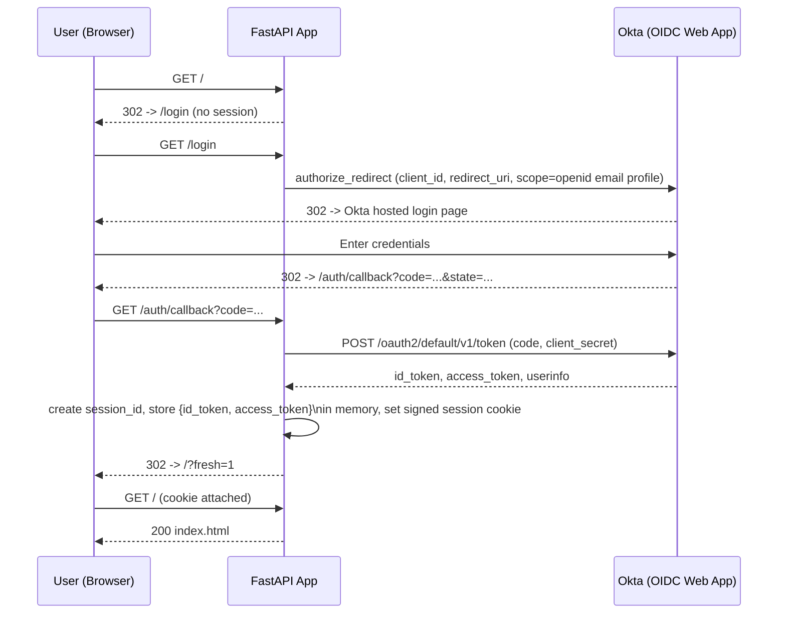
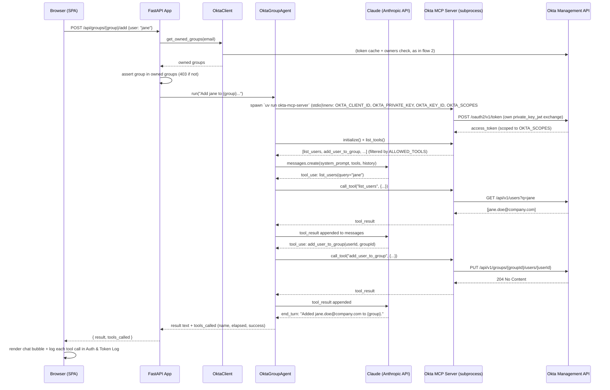

# Architecture

## Components

| Component | Role | Auth mechanism |
|---|---|---|
| **Browser (SPA)** | Static HTML/JS UI — group cards, chat, live auth/token log | Session cookie (server-side, signed) |
| **FastAPI App** (`app/main.py`) | Orchestrates OIDC login, ownership checks, and the Claude agent | Holds both Okta app integrations' credentials |
| **Okta (OIDC Web App)** | Authenticates the human user | Authorization Code flow (`openid email profile`) |
| **Okta (API Services App)** | Lets the backend call the Okta Management API | `private_key_jwt` client_credentials flow |
| **Okta Management API** | Source of truth for group ownership (native Owners tab) and group membership | Bearer token from API Services app |
| **Claude (Anthropic API)** | Interprets natural-language requests, decides which MCP tool to call | `ANTHROPIC_API_KEY` |
| **Okta MCP Server** (subprocess) | Executes group/user operations against Okta on Claude's behalf | Own `private_key_jwt` exchange, scoped via `OKTA_SCOPES` |

Two separate Okta app integrations exist because they serve different trust boundaries:
- The **OIDC Web App** proves *who the human is* (interactive, browser-based).
- The **API Services App** proves *what the backend is allowed to do* (machine-to-machine, no user in the loop). It is used twice, independently: once by `app/okta_client.py` for ownership checks, and once by the `okta-mcp-server` subprocess for the actual group-membership writes.

---

## 1. User login (OIDC Authorization Code)



---

## 2. Group ownership check (every login + 15s poll)

Ownership is never stored in the app — it's read live from Okta's native **group Owners** feature on each request.

```mermaid
sequenceDiagram
    participant U as Browser (SPA)
    participant App as FastAPI App
    participant OC as OktaClient (app/okta_client.py)
    participant Okta as Okta Management API

    U->>App: GET /api/me (cookie)
    App->>OC: get_owned_groups(email)
    OC->>OC: _ensure_token()\n(build RS256 JWT, cache until 60s before expiry)
    alt token expired or missing
        OC->>Okta: POST /oauth2/v1/token\n(client_credentials, client_assertion=JWT)
        Okta-->>OC: access_token (okta.users.read okta.groups.read)
    end
    OC->>Okta: GET /api/v1/users/{email} (resolve user id)
    Okta-->>OC: user.id
    loop for each group in MANAGED_GROUPS
        OC->>Okta: GET /api/v1/groups/{groupId}/owners
        Okta-->>OC: [owner, owner, ...]
        OC->>OC: owned if user.id in owners list
    end
    OC-->>App: [owned group names]
    App-->>U: { email, name, groups: [...] }
    U->>U: render one card per owned group

    loop every 15s (setInterval)
        U->>App: GET /api/me
        App-->>U: current groups
        U->>U: diff vs rendered cards; re-render + log if changed
    end
```

---

## 3. Add/Remove user or chat (Claude + Okta MCP Server)

Triggered by a group card button (Add/Remove) or a free-text chat message. Both paths call the same agent.



---

## 4. Combined auth flow — App ↔ Okta ↔ MCP Server (scopes & claims)

This consolidates flows 1–3 into a single sequence, annotated with the exact scopes requested and the claims each token carries. Three distinct tokens are in play, each with a different audience and purpose.

```mermaid
sequenceDiagram
    participant U as Browser
    participant App as FastAPI App
    participant OC as OktaClient
    participant Agent as OktaGroupAgent
    participant MCP as Okta MCP Server
    participant Okta as Okta (ic-demo.okta.com)

    rect rgb(20,30,55)
    Note over U,Okta: ① Human login — OIDC Web App (Authorization Code)
    U->>App: GET /login
    App->>Okta: authorize_redirect\nscope=openid email profile
    Okta-->>U: hosted login page
    U->>Okta: credentials
    Okta-->>App: 302 /auth/callback?code=...
    App->>Okta: POST /oauth2/default/v1/token\ngrant_type=authorization_code
    Okta-->>App: id_token + access_token
    Note right of Okta: ID Token claims:\niss = https://ic-demo.okta.com/oauth2/default\naud = OAUTH_OKTA_CLIENT_ID\nsub = Okta user id\nemail, name, auth_time, iat, exp\n\nAccess Token claims:\niss, sub, cid = OAUTH_OKTA_CLIENT_ID\nscp = [openid, email, profile]\nexp
    App->>App: store tokens in session,\nnever forwarded to MCP or Claude
    end

    rect rgb(20,45,30)
    Note over App,Okta: ② Backend → Okta Management API — API Services App (client_credentials)
    OC->>OC: build RS256 JWT\niss=sub=OKTA_MCP_CLIENT_ID, aud=token endpoint, kid=OKTA_KEY_ID
    OC->>Okta: POST /oauth2/v1/token\ngrant_type=client_credentials\nclient_assertion_type=jwt-bearer\nscope=okta.users.read okta.groups.read
    Okta-->>OC: access_token
    Note right of Okta: Access Token claims:\niss = https://ic-demo.okta.com\nsub = cid = OKTA_MCP_CLIENT_ID (no human "sub")\nscp = [okta.users.read, okta.groups.read]\nexp (cached client-side until exp-60s)
    OC->>Okta: GET /api/v1/users/{email}\nGET /api/v1/groups/{id}/owners
    Okta-->>OC: user id + owners list
    end

    rect rgb(55,40,15)
    Note over Agent,Okta: ③ MCP Server → Okta Management API — same API Services App, wider scope
    Agent->>MCP: spawn subprocess\nenv: OKTA_CLIENT_ID, OKTA_PRIVATE_KEY, OKTA_KEY_ID,\nOKTA_SCOPES=okta.users.read okta.groups.read okta.groups.manage
    MCP->>MCP: build its own RS256 JWT\n(independent of OC — separate token cache)
    MCP->>Okta: POST /oauth2/v1/token\ngrant_type=client_credentials\nscope=okta.users.read okta.groups.read okta.groups.manage
    Okta-->>MCP: access_token
    Note right of Okta: Access Token claims:\niss = https://ic-demo.okta.com\nsub = cid = OKTA_MCP_CLIENT_ID\nscp = [okta.users.read, okta.groups.read, okta.groups.manage]\n→ okta.groups.manage is the write scope;\n  absent from OC's token in step ②
    MCP->>MCP: prune tool registry to only\ntools covered by granted scopes
    Agent->>MCP: call_tool("add_user_to_group", {...})
    MCP->>Okta: PUT /api/v1/groups/{groupId}/users/{userId}\nAuthorization: Bearer <MCP's token>
    Okta-->>MCP: 204 No Content
    end
```

**Why three separate tokens, not one:**

| Token | Issued to | Scopes | Used for |
|---|---|---|---|
| ID Token (①) | Human user | `openid email profile` | Proving identity to the app; displayed read-only in the UI |
| OktaClient access token (②) | API Services App | `okta.users.read`, `okta.groups.read` | Read-only ownership checks — deliberately excludes `okta.groups.manage` |
| MCP Server access token (③) | Same API Services App | `okta.users.read`, `okta.groups.read`, `okta.groups.manage` | The only token capable of writing group membership |

The app's own ownership-check token (②) is intentionally read-only. Even if `app/okta_client.py` had a bug, it has no `okta.groups.manage` scope and physically cannot mutate a group — only the MCP subprocess's token (③) can, and it's invoked exclusively through the tool-calling loop, one Claude decision at a time.

---

## 5. Full detailed flow — App, both Okta App Integrations, Authorization Server, and MCP Server

The most granular view: names both Okta app integrations explicitly (OIDC Web App vs. API Services/MCP App), and walks a concrete worked example (Alex Rivera adding a user to `AWSDEV-1000-Operator`) through every hop, including the 403 short-circuit and the MCP server's independent token exchange.

```mermaid
sequenceDiagram
    autonumber
    actor Alex as Alex Rivera (Group Owner)
    participant Browser as Browser (SPA)
    participant App as FastAPI App (Backend)
    participant OIDCApp as Okta OIDC App<br/>(Web App Integration)
    participant Okta as Okta Authorization Server<br/>(ic-demo.okta.com)
    participant MCPApp as Okta API Services App<br/>(MCP Server Integration)
    participant MCP as Okta MCP Server<br/>(local subprocess)

    Note over Alex,MCP: PHASE 1 — Human Authentication (OIDC Authorization Code Flow)

    Alex->>Browser: Open app
    Browser->>App: GET /
    App-->>Browser: 302 -> /login (no session cookie)
    Browser->>App: GET /login
    App->>OIDCApp: authorize_redirect()<br/>client_id=OAUTH_OKTA_CLIENT_ID<br/>redirect_uri=/auth/callback<br/>scope="openid email profile"<br/>response_type=code
    OIDCApp->>Okta: Resolve app config (client_id, redirect_uris)
    Okta-->>Browser: 302 -> Okta Hosted Sign-In Page
    Browser->>Okta: GET /login/login.htm
    Okta-->>Browser: Render login form
    Alex->>Browser: Enter credentials (+ MFA if required)
    Browser->>Okta: POST credentials
    Okta->>Okta: Validate credentials + evaluate<br/>Sign-On Policy for OIDC App
    Okta-->>Browser: 302 -> /auth/callback?code=AUTH_CODE&state=...
    Browser->>App: GET /auth/callback?code=AUTH_CODE

    Note over App,Okta: PHASE 2 — Authorization Code Exchange (confidential client)

    App->>Okta: POST /oauth2/default/v1/token<br/>grant_type=authorization_code<br/>code=AUTH_CODE<br/>client_id + client_secret
    Okta->>OIDCApp: Verify client_secret against OIDC App registration
    Okta-->>App: 200 OK { id_token, access_token, expires_in }
    Note right of Okta: ID TOKEN claims:<br/>iss=.../oauth2/default  aud=OAUTH_OKTA_CLIENT_ID<br/>sub=Alex's Okta user ID<br/>email=alex.rivera@atko.email<br/>name, auth_time, iat, exp<br/><br/>ACCESS TOKEN claims:<br/>iss, sub=cid=OAUTH_OKTA_CLIENT_ID<br/>scp=[openid, email, profile]  exp

    App->>App: Create session_id (UUID)<br/>store {id_token, access_token} server-side<br/>set signed session cookie
    App-->>Browser: 302 -> / (+ session cookie)
    Browser->>App: GET / (cookie attached)
    App-->>Browser: 200 index.html (SPA)

    Note over Alex,MCP: PHASE 3 — Authorization Check: Is Alex an Owner? (on load + every 15s)

    Browser->>App: GET /api/me (cookie)
    App->>App: get_owned_groups(alex.rivera@atko.email)
    App->>App: Check cached client_credentials token (expires in > 60s?)

    alt Token expired or not cached
        App->>MCPApp: Build RS256 JWT assertion<br/>iss=sub=OKTA_MCP_CLIENT_ID, aud=token endpoint, kid=OKTA_KEY_ID
        App->>Okta: POST /oauth2/v1/token<br/>grant_type=client_credentials<br/>client_assertion_type=jwt-bearer<br/>client_assertion=&lt;signed JWT&gt;<br/>scope="okta.users.read okta.groups.read"
        Okta->>MCPApp: Verify JWT signature vs registered public key (kid match)
        Okta-->>App: 200 OK { access_token, expires_in }
        Note right of Okta: ACCESS TOKEN claims:<br/>iss=https://ic-demo.okta.com<br/>sub=cid=OKTA_MCP_CLIENT_ID<br/>scp=[okta.users.read, okta.groups.read]<br/>READ-ONLY — no okta.groups.manage  exp
    end

    App->>Okta: GET /api/v1/users/alex.rivera@atko.email<br/>Authorization: Bearer &lt;read-only token&gt;
    Okta-->>App: 200 OK { id: "00u249j3...", profile }
    App->>Okta: GET /api/v1/groups/{AWSDEV-1000-Operator id}/owners<br/>Authorization: Bearer &lt;read-only token&gt;
    Okta-->>App: 200 OK [ { id: "00u249j3..." } ]
    App->>App: user.id found in owners list -> OWNED
    App-->>Browser: 200 { email, name, groups:["AWSDEV-1000-Operator"] }
    Browser->>Browser: Render "AWSDEV-1000-Operator" group card

    Note over Alex,MCP: PHASE 4 — Authorized Action: Add User to Owned Group

    Alex->>Browser: "Add jane.doe to AWSDEV-1000-Operator"<br/>(chat or Add-User button)
    Browser->>App: POST /api/groups/AWSDEV-1000-Operator/add<br/>{ user:"jane.doe" }  (cookie)
    App->>App: get_owned_groups(alex) again;<br/>assert group in owned list
    alt Not authorized
        App-->>Browser: 403 "You are not authorized to manage<br/>members of the {group} Group."
    end

    App->>MCP: Spawn subprocess `uv run okta-mcp-server` (stdio)<br/>env: OKTA_CLIENT_ID, OKTA_PRIVATE_KEY, OKTA_KEY_ID, OKTA_SCOPES

    Note over MCP,MCPApp: PHASE 5 — MCP Server's OWN Authentication (independent token)

    MCP->>MCP: Build its own RS256 JWT assertion<br/>(separate token cache from App's)
    MCP->>Okta: POST /oauth2/v1/token<br/>grant_type=client_credentials<br/>client_assertion_type=jwt-bearer<br/>scope="okta.users.read okta.groups.read okta.groups.manage"
    Okta->>MCPApp: Verify JWT signature<br/>(same App Services App + key pair as Phase 3, wider scope requested)
    Okta-->>MCP: 200 OK { access_token, expires_in }
    Note right of Okta: ACCESS TOKEN claims:<br/>iss=https://ic-demo.okta.com<br/>sub=cid=OKTA_MCP_CLIENT_ID<br/>scp=[okta.users.read, okta.groups.read,<br/>okta.groups.manage] <-- WRITE scope  exp

    MCP->>MCP: scope_guard: prune tool registry to<br/>tools covered by granted scopes<br/>(13 of 107 tools enabled)
    App->>MCP: initialize() + list_tools()
    MCP-->>App: [list_users, get_user, list_groups, get_group,<br/>list_group_users, add_user_to_group,<br/>remove_user_from_group]<br/>(further filtered by app's ALLOWED_TOOLS)

    Note over App,MCP: PHASE 6 — Claude Tool-Calling Loop

    App->>App: Claude (Anthropic API): messages.create(system_prompt, tools, history)
    App-->>App: Claude decides: tool_use "list_users"
    App->>MCP: call_tool("list_users", {q:"jane.doe"})
    MCP->>Okta: GET /api/v1/users?q=jane.doe<br/>Authorization: Bearer &lt;write-scoped token&gt;
    Okta-->>MCP: 200 OK [ { id, profile:{email:jane.doe@...} } ]
    MCP-->>App: tool_result: user found

    App->>App: Claude decides: tool_use "add_user_to_group"
    App->>MCP: call_tool("add_user_to_group", {userId, groupId})
    MCP->>Okta: PUT /api/v1/groups/{groupId}/users/{userId}<br/>Authorization: Bearer &lt;write-scoped token&gt;
    Okta->>Okta: Verify token scope includes okta.groups.manage -> ALLOW
    Okta-->>MCP: 204 No Content
    MCP-->>App: tool_result: success

    App->>App: Claude: end_turn<br/>"Added jane.doe@... to AWSDEV-1000-Operator."
    App-->>Browser: 200 { result, tools_called }
    Browser-->>Alex: Render chat bubble + log entries in Auth & Token Log panel
```

**Structural notes:**
- Two distinct token endpoints are used: `/oauth2/default/v1/token` for the human OIDC flow vs. the org-level `/oauth2/v1/token` for both `client_credentials` exchanges.
- `MCPApp` (the API Services App) is hit twice, independently, by two different callers — the App's `OktaClient` and the MCP subprocess — using the same credentials but requesting different scopes, producing two different tokens with different capabilities.
- The two `alt` blocks are the two authorization gates in this flow: the read-only ownership check (Phase 3) and the 403 short-circuit that happens *before* the MCP subprocess is ever spawned (Phase 4) — an unauthorized request never reaches Okta's write API at all.

---

## Key design points

- **No ownership data lives in the app.** `config/group_owners.yaml` was removed; `app/okta_client.py` reads Okta's native group Owners list on every request. Changing owners in the Admin Console takes effect within one poll cycle (≤15s), no restart needed.
- **Two independent `private_key_jwt` exchanges.** The FastAPI backend (`OktaClient`) and the `okta-mcp-server` subprocess each authenticate to Okta separately, with their own token cache. They share the same API Services app credentials but never share tokens.
- **Tool allow-list is enforced twice**: once by `OKTA_SCOPES` passed to the MCP server (server-side scope pruning — disabled tools are never registered), and again by `ALLOWED_TOOLS` in `app/agent.py` (client-side filter before tools are ever shown to Claude).
- **Session state is server-side and in-memory** (`_histories`, `_token_store` in `app/main.py`), keyed by a `session_id` inside the signed cookie — no tokens are ever sent to the browser except for the read-only display in the Auth & Token Log panel.
- **Sign-out clears both sessions**: the local cookie session AND the Okta SSO session (via `/oauth2/default/v1/logout` with `id_token_hint`), preventing silent re-authentication.
