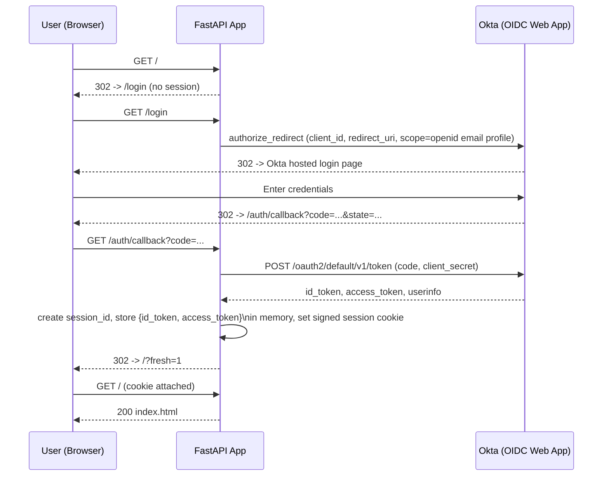
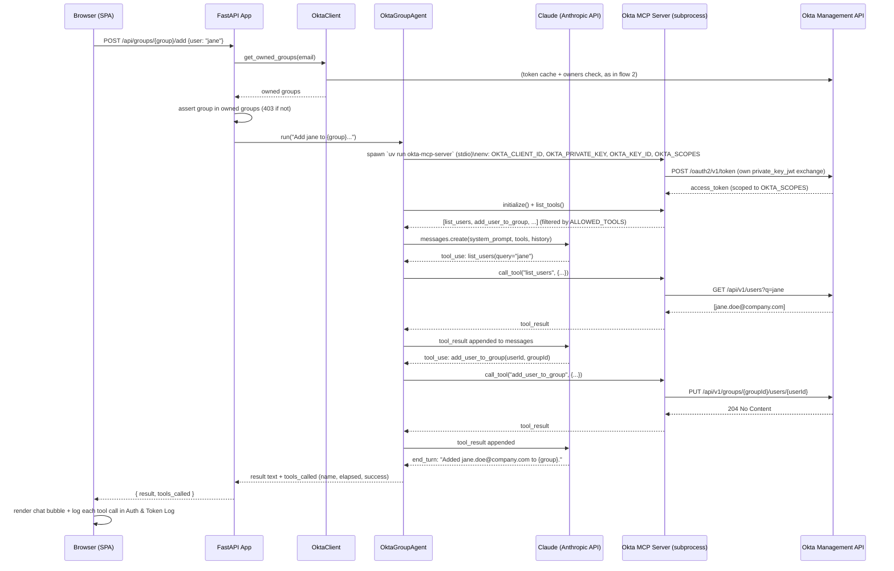

# Architecture

## Components

| Component | Role | Auth mechanism |
|---|---|---|
| **Browser (SPA)** | Static HTML/JS UI — group cards, chat, live auth/token log | Session cookie (server-side, signed) |
| **FastAPI App** (`app/main.py`) | Orchestrates OIDC login, ownership checks, and the Claude agent | Holds both Okta app integrations' credentials |
| **Okta (OIDC Web App)** | Authenticates the human user | Authorization Code flow (`openid email profile`) |
| **Okta (API Services App)** | Lets the backend call the Okta Management API | `private_key_jwt` client_credentials flow |
| **Okta Management API** | Source of truth for group ownership (native Owners tab) and group membership | Bearer token from API Services app |
| **Claude (Anthropic API)** | Interprets natural-language requests, decides which MCP tool to call | `ANTHROPIC_API_KEY` |
| **Okta MCP Server** (subprocess) | Executes group/user operations against Okta on Claude's behalf | Own `private_key_jwt` exchange, scoped via `OKTA_SCOPES` |

Two separate Okta app integrations exist because they serve different trust boundaries:
- The **OIDC Web App** proves *who the human is* (interactive, browser-based).
- The **API Services App** proves *what the backend is allowed to do* (machine-to-machine, no user in the loop). It is used twice, independently: once by `app/okta_client.py` for ownership checks, and once by the `okta-mcp-server` subprocess for the actual group-membership writes.

---

## 1. User login (OIDC Authorization Code)



---

## 2. Group ownership check (every login + 15s poll)

Ownership is never stored in the app — it's read live from Okta's native **group Owners** feature on each request.

```mermaid
sequenceDiagram
    participant U as Browser (SPA)
    participant App as FastAPI App
    participant OC as OktaClient (app/okta_client.py)
    participant Okta as Okta Management API

    U->>App: GET /api/me (cookie)
    App->>OC: get_owned_groups(email)
    OC->>OC: _ensure_token()\n(build RS256 JWT, cache until 60s before expiry)
    alt token expired or missing
        OC->>Okta: POST /oauth2/v1/token\n(client_credentials, client_assertion=JWT)
        Okta-->>OC: access_token (okta.users.read okta.groups.read)
    end
    OC->>Okta: GET /api/v1/users/{email} (resolve user id)
    Okta-->>OC: user.id
    loop for each group in MANAGED_GROUPS
        OC->>Okta: GET /api/v1/groups/{groupId}/owners
        Okta-->>OC: [owner, owner, ...]
        OC->>OC: owned if user.id in owners list
    end
    OC-->>App: [owned group names]
    App-->>U: { email, name, groups: [...] }
    U->>U: render one card per owned group

    loop every 15s (setInterval)
        U->>App: GET /api/me
        App-->>U: current groups
        U->>U: diff vs rendered cards; re-render + log if changed
    end
```

---

## 3. Add/Remove user or chat (Claude + Okta MCP Server)

Triggered by a group card button (Add/Remove) or a free-text chat message. Both paths call the same agent.



---

## Key design points

- **No ownership data lives in the app.** `config/group_owners.yaml` was removed; `app/okta_client.py` reads Okta's native group Owners list on every request. Changing owners in the Admin Console takes effect within one poll cycle (≤15s), no restart needed.
- **Two independent `private_key_jwt` exchanges.** The FastAPI backend (`OktaClient`) and the `okta-mcp-server` subprocess each authenticate to Okta separately, with their own token cache. They share the same API Services app credentials but never share tokens.
- **Tool allow-list is enforced twice**: once by `OKTA_SCOPES` passed to the MCP server (server-side scope pruning — disabled tools are never registered), and again by `ALLOWED_TOOLS` in `app/agent.py` (client-side filter before tools are ever shown to Claude).
- **Session state is server-side and in-memory** (`_histories`, `_token_store` in `app/main.py`), keyed by a `session_id` inside the signed cookie — no tokens are ever sent to the browser except for the read-only display in the Auth & Token Log panel.
- **Sign-out clears both sessions**: the local cookie session AND the Okta SSO session (via `/oauth2/default/v1/logout` with `id_token_hint`), preventing silent re-authentication.
